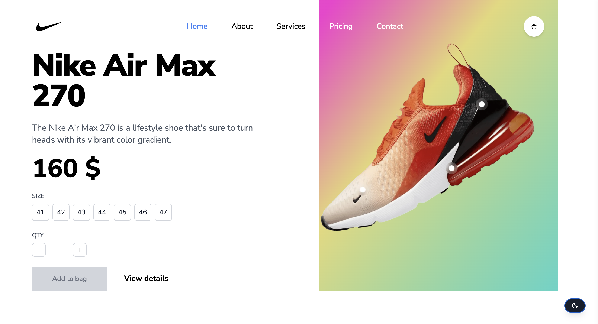
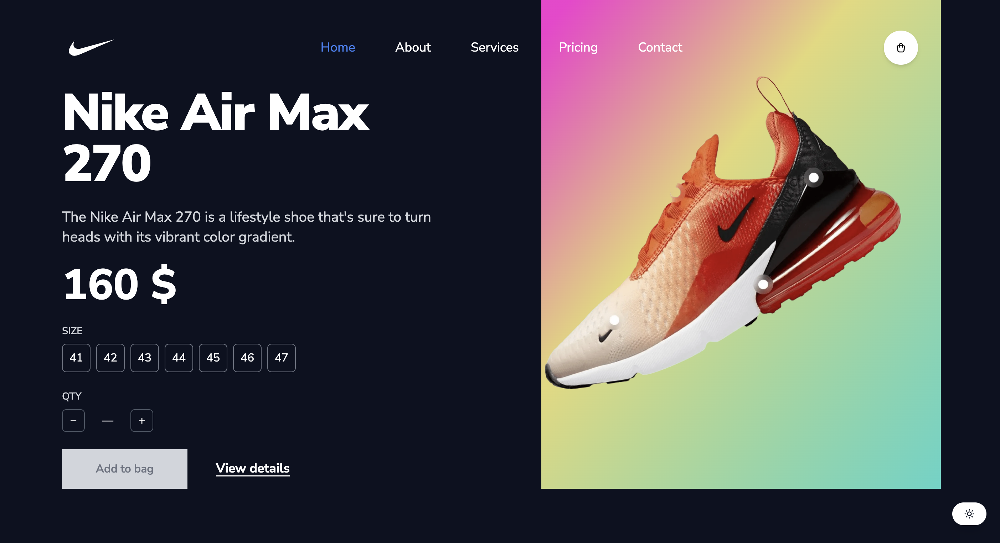

# Nike Shoe Store — E-commerce UI

A responsive e-commerce shoe store built with React 18, TypeScript, Tailwind CSS, and Vite. Originally based on a course project, substantially refactored for type safety, accessibility, state management, and performance.

## Screenshots

| Light Mode | Dark Mode |
|---|---|
|  |  |

## Tech Stack


## Features

- Browse a Nike shoe collection with size and quantity selection
- Fully functional cart: add, update quantity/size, and remove items, with live total price calculation (checkout flow not implemented — out of scope for this demo)
- Slide-out cart sidebar (closable via button or backdrop click)
- Dark/light mode with `localStorage` persistence and smooth color transitions
- Fully responsive layout, including fixed UI elements adapted per breakpoint
- Accessible UI: semantic buttons, ARIA labels, keyboard-navigable controls, sufficient touch targets
- Optimized product images (WebP, ~70% smaller than original PNGs)

## Architecture Notes

- **Cart state** is managed via `useReducer` (`src/reducers/cartReducer.ts`) with explicit `ADD` / `REMOVE` / `UPDATE_QTY` / `UPDATE_SIZE` actions, instead of scattered `useState` calls — keeps state transitions predictable and easy to test.
- **Shared types** (`src/types/cart.ts`) are extracted to avoid duplicated interfaces across components.
- **`useDarkMode`** is a custom hook encapsulating theme persistence, using a lazy `useState` initializer to avoid a flash of the wrong theme on load, with `try/catch` around `localStorage` for Safari private-mode safety.
- **Type-aware linting** via `@typescript-eslint` with `recommended-requires-type-checking` and `consistent-type-imports`, catching issues plain ESLint would miss.

## UI Overview

1. **Navigation Bar** — logo, menu links, and cart button (mobile: hamburger menu)
2. **Product Display** — hero product view with size/quantity selection and "Add to bag" CTA
3. **New Arrivals Section** — grid of featured shoes with hover effects
4. **Sidebar Cart** — slide-out cart with per-item controls and running total
5. **Dark Mode Toggle** — fixed button, responsive positioning across breakpoints

## Project Directory Structure

tailwindNike/
├── public/
│   └── vite.svg
├── src/
│   ├── assets/                 # Images (WebP) and SVGs
│   ├── components/
│   │   ├── Card.tsx
│   │   ├── Cart.tsx
│   │   ├── CartItem.tsx
│   │   ├── Nav.tsx
│   │   ├── NewArrivalsSection.tsx
│   │   ├── Select.tsx
│   │   ├── Sidebar.tsx
│   │   └── ShoeDetail.tsx
│   ├── constants/
│   │   └── index.ts
│   ├── hooks/
│   │   └── useDarkMode.ts
│   ├── reducers/
│   │   └── cartReducer.ts
│   ├── types/
│   │   └── cart.ts
│   ├── App.tsx
│   ├── index.tsx
│   ├── index.css
│   └── ...
├── .gitignore
├── index.html
├── package.json
├── README.md
├── tsconfig.json
├── tsconfig.node.json
├── tailwind.config.js
└── vite.config.ts


## Local Setup & Build Instructions

### Prerequisites

- Node.js (v18 or higher)
- npm (v9 or higher)

### Installation

```bash
git clone https://github.com/vladikhan/tailwindNike.git
cd tailwindNike
npm install
```

### Development Server

```bash
npm run dev
```
Available at `http://localhost:5173`.

### Building for Production

```bash
npm run build
```
Output in `dist/`.

### Preview Production Build

```bash
npm run preview
```

### Linting & Type Checking

```bash
npm run lint
npm run typecheck
```

## Contributing

Contributions are welcome! Feel free to submit a Pull Request.

## License

This project is open source and available under the [MIT License](LICENSE).
